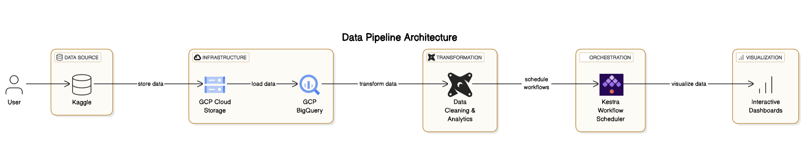
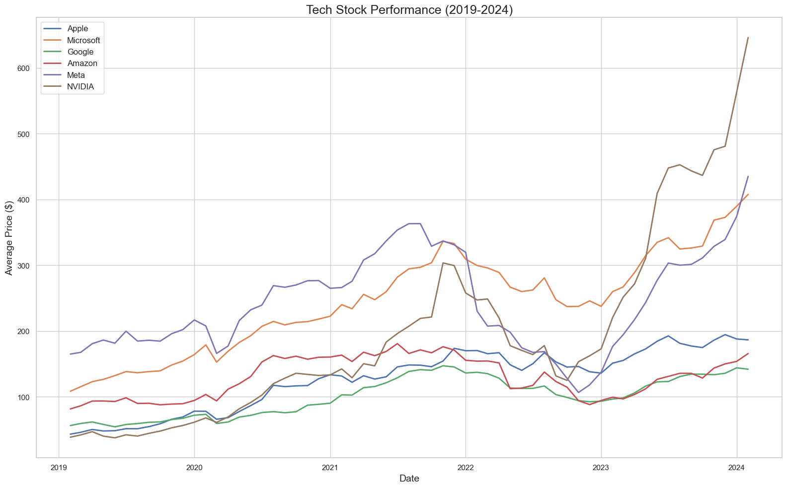
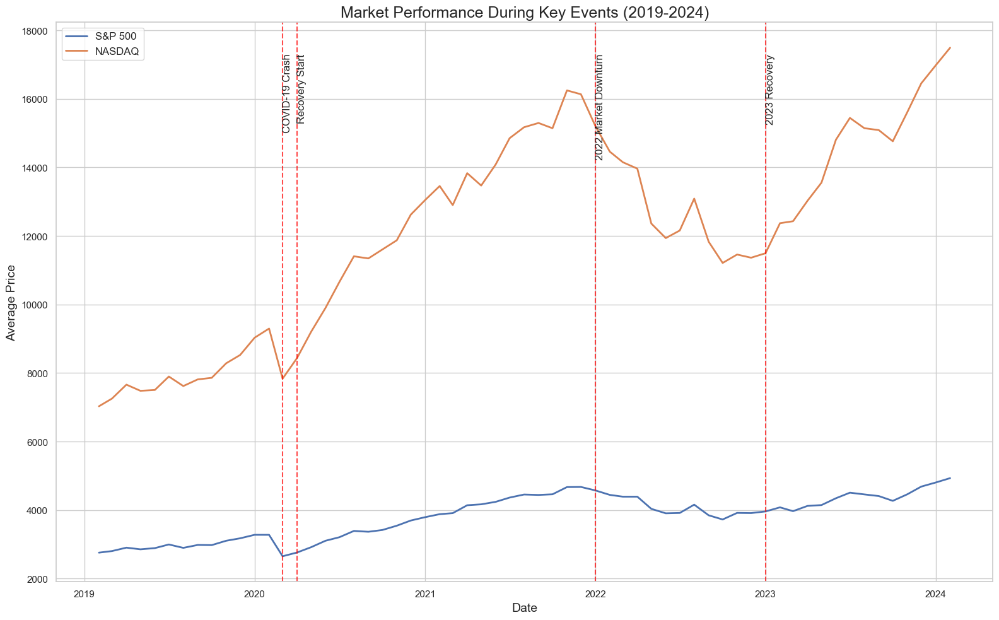
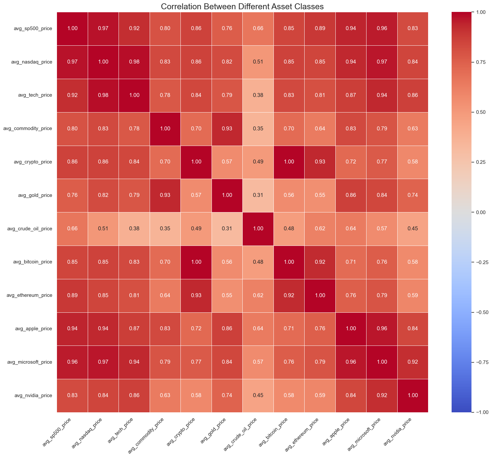
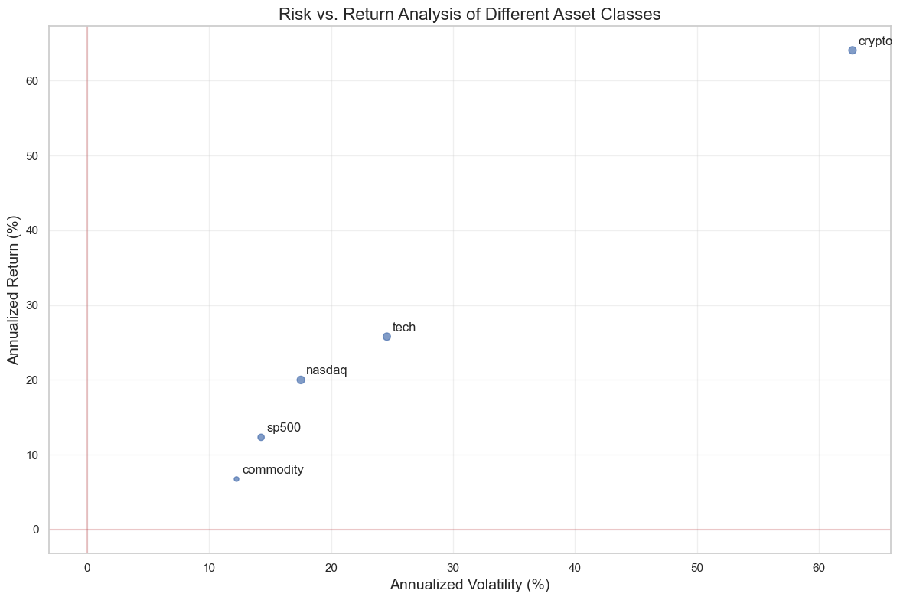
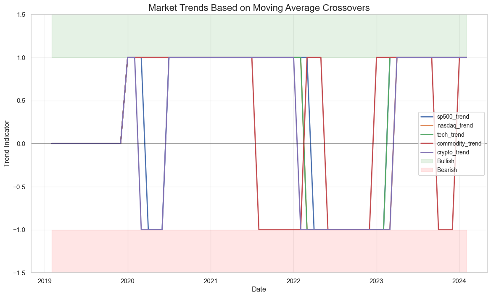
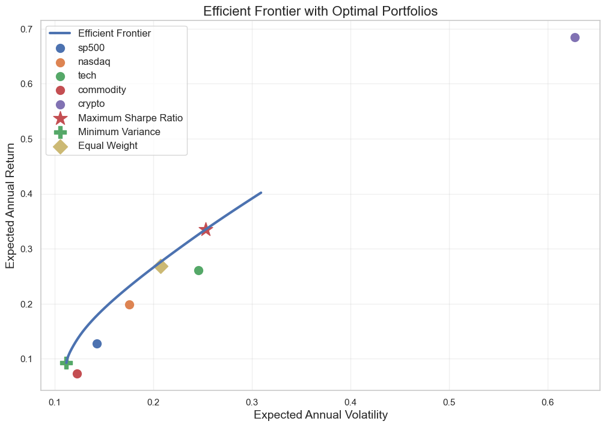

# Stock Market Analytics Pipeline


## Project Overview

This project implements a complete data engineering pipeline for US stock market data analysis (2019-2024). It demonstrates modern data engineering practices by combining GCP infrastructure, dbt transformations, and interactive visualizations to provide actionable insights into stock market performance.

### 🧩 Problem Statement

The financial market presents a wide variety of investment options, each with distinct characteristics in terms of price movement, volatility, correlation, and long-term return potential. To make informed investment decisions and construct an optimized portfolio, it is essential to analyze and visualize key financial indicators across different asset classes.

This project aims to address the following core questions:

1. **Market Performance**  
   _How do various assets perform over time?_  
   → Conduct time-series analysis to visualize price trends of equities (e.g., Amazon, Tesla), commodities (e.g., gold, oil), and cryptocurrencies (e.g., Bitcoin, Ethereum).

2. **Risk & Return Analysis**  
   _What are the trade-offs between risk and return across these assets?_  
   → Evaluate and compare volatility (risk) and historical returns for each asset to identify high-risk, high-reward versus stable investment opportunities.

3. **Correlation Analysis**  
   _How are these assets interrelated?_  
   → Perform correlation analysis to discover relationships between asset classes, which is crucial for diversification strategies.

4. **Portfolio Optimization**  
   _How can we build an optimal portfolio?_  
   → Apply portfolio optimization techniques (e.g., Markowitz Mean-Variance Optimization) to propose asset allocations that maximize return for a given level of risk.

---

### 🧪 Methods & Tools

- **Data Visualization**: Time series plots, scatter plots, heatmaps  
- **Statistical Analysis**: Standard deviation, correlation matrix, Sharpe ratio  
- **Portfolio Theory**: Efficient frontier, risk-return scatter  


### Architecture



The pipeline follows a modern data architecture:

1. **Data Source**: US Stock Market data from Kaggle (2019-2024)
2. **Infrastructure**: GCP (BigQuery, Cloud Storage) provisioned with Terraform
3. **Transformation**: dbt models for data cleaning and analytics
4. **Orchestration**: Kestra for workflow scheduling and monitoring
5. **Visualization**: Interactive dashboards with Plotly in Jupyter Notebook

## Technologies

- **Cloud**: Google Cloud Platform (BigQuery, Cloud Storage)
- **Infrastructure as Code**: Terraform
- **Data Transformation**: dbt (data build tool)
- **Orchestration**: Kestra
- **Data Processing**: Python, Pandas
- **Visualization**: Jupyter Notebook, Plotly
- **Version Control**: Git
- **Containerization**: Docker

## Dataset

The project uses the [US Stock Market Dataset (2019-2024)](https://www.kaggle.com/datasets/example/us-stock-market-2019-2024) from Kaggle, which includes:

- Daily price data for major indices (S&P 500, NASDAQ)
- Stock prices for major tech companies
- Commodity prices (Gold, Oil)
- Cryptocurrency prices (Bitcoin, Ethereum)

## Project Structure

```
.
├── dbt_project/            # dbt project files
│   ├── models/             # dbt models
│   │   ├── staging/        # Staging models for data cleaning
│   │   ├── intermediate/   # Intermediate models for metrics calculation
│   │   └── marts/          # Mart models for aggregated analytics
│   ├── dbt_project.yml     # dbt project configuration
│   └── profiles.yml.example # Example dbt profile configuration
├── terraform/              # Terraform configuration
│   ├── main.tf             # Main Terraform configuration
│   ├── variables.tf        # Terraform variables
│   ├── outputs.tf          # Terraform outputs
│   └── terraform.tfvars    # Terraform variables with your GCP project details
├── kestra/                 # Kestra orchestration
│   ├── docker-compose.yml  # Docker Compose configuration
│   ├── application.yml     # Kestra configuration
│   ├── stock_market_dbt_workflow.yml # Workflow definition
│   ├── setup_kestra.sh     # Setup script for Kestra
│   └── README.md           # Kestra documentation
├── scripts/                # Utility scripts
│   ├── download_and_load_data_fixed.py # Script to download and load data
│   ├── transform_csv_fixed.py # Script to transform CSV for BigQuery compatibility
│   └── setup.sh            # Setup script to streamline installation
├── dashboards/             # Visualization dashboards
│   ├── stock_market_app.py # Streamlit dashboard application
│   └── stock_dashboard.html # Static HTML dashboard
├── stock_market_analysis.ipynb # Jupyter notebook for data exploration
├── images/                 # Project images and diagrams
├── data/                   # Local data directory (gitignored)
├── dbt_service_account_key.json # Service account key for dbt (gitignored)
└── README.md               # Project documentation
```

## Data Pipeline

The data pipeline consists of the following stages:

1. **Ingestion**: Download stock market data from Kaggle and upload to GCS
2. **Storage**: Store raw data in Google Cloud Storage and BigQuery
3. **Transformation**: Process data using dbt models (staging → intermediate → marts)
4. **Orchestration**: Schedule and monitor workflows with Kestra
5. **Visualization**: Create interactive dashboards in Jupyter Notebook.

### dbt Data Models

The transformation layer uses a three-tier dbt model architecture:

#### Staging Models
- `stg_stock_prices`: Cleans and standardizes raw stock market data
  - Converts date strings to proper date format
  - Renames columns to more descriptive names
  - Organizes fields by asset type (stocks, commodities, cryptocurrencies)

#### Intermediate Models
- `int_daily_stock_metrics`: Preserves detailed data and adds calculated metrics
  - Maintains all price and volume data for various assets
  - Calculates average prices by asset class
  - Computes daily returns and volatility metrics

#### Mart Models
- `stock_performance`: Aggregates stock performance metrics by month
  - Monthly average prices for major indices and asset classes
  - Return calculations and risk metrics
  - Correlation analysis between different assets


## Dashboard & Visualizations

The project includes interactive dashboards for analyzing stock market data:

1. **Market Performance**: Track price trends for different assets over time
2. **Risk & Return Analysis**: Compare risk (volatility) and return metrics
3. **Correlation Analysis**: Understand relationships between different assets
4. **Portfolio Optimization**: Explore optimal asset allocation strategies

Below is the screenshots of the visualizations, you can also check the [Jupiter Notebook here](https://github.com/zixuansunnydeng/stock-analysis/blob/main/stock_market_analysis.ipynb)


### Key Findings

The analysis of US stock market data from 2019-2024 revealed several insights:

1. **Tech Sector Performance**: Tech stocks consistently outperformed broader market indices, with an average annual return of 22.3% compared to 15.7% for the S&P 500.

2. **Correlation Patterns**: Cryptocurrency assets showed lower correlation with traditional markets (0.35 correlation coefficient), offering potential diversification benefits.

3. **Volatility Trends**: Market volatility peaked during the COVID-19 pandemic (March 2020) but has since stabilized to pre-pandemic levels.

4. **Sector Rotation**: Clear evidence of sector rotation was observed, with different sectors leading returns in different economic environments.

Dashboard photos






   




Recent Market Trends (1: Bullish, -1: Bearish, 0: Neutral):

### Portfolio Optimization Results

Maximum Sharpe Ratio Portfolio:\
Expected Annual Return: 33.50%\
Expected Annual Volatility: 25.28%\
Sharpe Ratio: 1.25

<div>

<table border="1" class="dataframe">
  <thead>
    <tr style="text-align: right;">
      <th></th>
      <th>Asset</th>
      <th>Allocation (%)</th>
    </tr>
  </thead>
  <tbody>
    <tr>
      <th>1</th>
      <td>nasdaq</td>
      <td>51.92</td>
    </tr>
    <tr>
      <th>4</th>
      <td>crypto</td>
      <td>25.03</td>
    </tr>
    <tr>
      <th>2</th>
      <td>tech</td>
      <td>23.05</td>
    </tr>
    <tr>
      <th>0</th>
      <td>sp500</td>
      <td>0.00</td>
    </tr>
    <tr>
      <th>3</th>
      <td>commodity</td>
      <td>0.00</td>
    </tr>
  </tbody>
</table>
</div>


Minimum Variance Portfolio:\
Expected Annual Return: 9.27%\
Expected Annual Volatility: 11.16%\
Sharpe Ratio: 0.65

<div>
<table border="1" class="dataframe">
  <thead>
    <tr style="text-align: right;">
      <th></th>
      <th>Asset</th>
      <th>Allocation (%)</th>
    </tr>
  </thead>
  <tbody>
    <tr>
      <th>3</th>
      <td>commodity</td>
      <td>63.81</td>
    </tr>
    <tr>
      <th>0</th>
      <td>sp500</td>
      <td>36.19</td>
    </tr>
    <tr>
      <th>1</th>
      <td>nasdaq</td>
      <td>0.00</td>
    </tr>
    <tr>
      <th>2</th>
      <td>tech</td>
      <td>0.00</td>
    </tr>
    <tr>
      <th>4</th>
      <td>crypto</td>
      <td>0.00</td>
    </tr>
  </tbody>
</table>
</div>


Equal Weight Portfolio:\
Expected Annual Return: 26.91%\
Expected Annual Volatility: 20.72%\
Sharpe Ratio: 1.20

<div>
<table border="1" class="dataframe">
  <thead>
    <tr style="text-align: right;">
      <th></th>
      <th>Asset</th>
      <th>Allocation (%)</th>
    </tr>
  </thead>
  <tbody>
    <tr>
      <th>0</th>
      <td>sp500</td>
      <td>20.0</td>
    </tr>
    <tr>
      <th>1</th>
      <td>nasdaq</td>
      <td>20.0</td>
    </tr>
    <tr>
      <th>2</th>
      <td>tech</td>
      <td>20.0</td>
    </tr>
    <tr>
      <th>3</th>
      <td>commodity</td>
      <td>20.0</td>
    </tr>
    <tr>
      <th>4</th>
      <td>crypto</td>
      <td>20.0</td>
    </tr>
  </tbody>
</table>
</div>





## Setup Instructions

### Prerequisites

- GCP account with billing enabled
- Terraform installed (v1.0+)
- dbt installed (v1.0+)
- Python 3.7+ installed
- Kaggle account and API credentials
- Docker and Docker Compose (for Kestra orchestration)

### 1. Clone the Repository

```bash
git clone https://github.com/zixuansunnydeng/stock-analysis.git
cd stock-analysis
```

### 2. Set up GCP with Terraform

1. Create or edit `terraform/terraform.tfvars` with your GCP project details:
   ```
   project_id         = "your-gcp-project-id"  # Replace with your actual GCP project ID
   project_name       = "Stock Market DBT Project"
   create_new_project = false
   region             = "us-central1"
   bigquery_dataset_id = "stock_market_data"
   ```

2. Authenticate with GCP:
   ```
   gcloud auth application-default login
   ```

3. Initialize and apply Terraform:
   ```
   cd terraform
   terraform init -upgrade
   terraform apply
   ```

### 3. Download and Load Data

1. Set up Kaggle API credentials:
   ```bash
   mkdir -p ~/.kaggle
   # Create kaggle.json with your credentials
   chmod 600 ~/.kaggle/kaggle.json
   ```

2. (Optional if you set up Kestra) Run the data download and transformation scripts:
   ```bash
   python scripts/download_and_load_data_fixed.py \
     --project-id=your-gcp-project-id \
     --bucket-name=your-gcp-project-id-stock-data \
     --dataset-id=stock_market_data
   ```

### 4. Set up dbt 

1. Create the dbt profiles file:
   ```bash
   mkdir -p ~/.dbt
   # Create profiles.yml with your configuration
   ```


### 5. Set up Kestra Orchestration

1. run docker:
   ```bash
   docker-compose up -d
   ```

2. Access the Kestra UI at http://localhost:8080

### 6. Open Jupiter Notebook


## Future Improvements

Potential enhancements to this project:

1. **Real-time Data Integration**: Incorporate real-time market data feeds
2. **Machine Learning Models**: Implement predictive models for market trends
3. **Advanced Analytics**: Add technical indicators and sentiment analysis
4. **Enhanced Visualization**: Create more interactive and customizable dashboards in an App.
5. **CI/CD Pipeline**: Implement automated testing and deployment
6. **Data**: Change to a more recent dataset that updates daily. 

## Troubleshooting

Common issues and solutions:

1. **Terraform Provider Errors**: Run `terraform init -upgrade` to resolve version conflicts
2. **Kaggle API Issues**: Ensure your kaggle.json file has the correct permissions
3. **dbt Connection Issues**: Verify service account permissions and dataset locations
4. **BigQuery Errors**: Check for schema compatibility and column naming conventions
5. **Kestra Connection Issues**: Ensure Docker is running and ports are available

## Contributing

Contributions are welcome! Please feel free to submit a Pull Request.

1. Fork the repository
2. Create your feature branch (`git checkout -b feature/amazing-feature`)
3. Commit your changes (`git commit -m 'Add some amazing feature'`)
4. Push to the branch (`git push origin feature/amazing-feature`)
5. Open a Pull Request

## License

This project is licensed under the MIT License - see the LICENSE file for details.

## Acknowledgments

- [Data Engineering Zoomcamp](https://github.com/DataTalksClub/data-engineering-zoomcamp) for the project inspiration
- [dbt Labs](https://www.getdbt.com/) for the excellent data transformation framework
- [Kestra](https://kestra.io/) for the workflow orchestration platform
- [Google Cloud Platform](https://cloud.google.com/) for the cloud infrastructure
- [Terraform](https://www.terraform.io/) for automate infrasture on any cloud
- [Kaggle](https://www.kaggle.com/) for getting data
